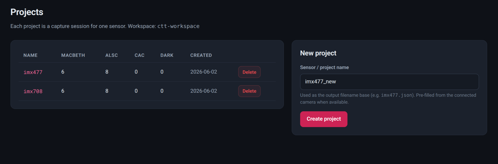
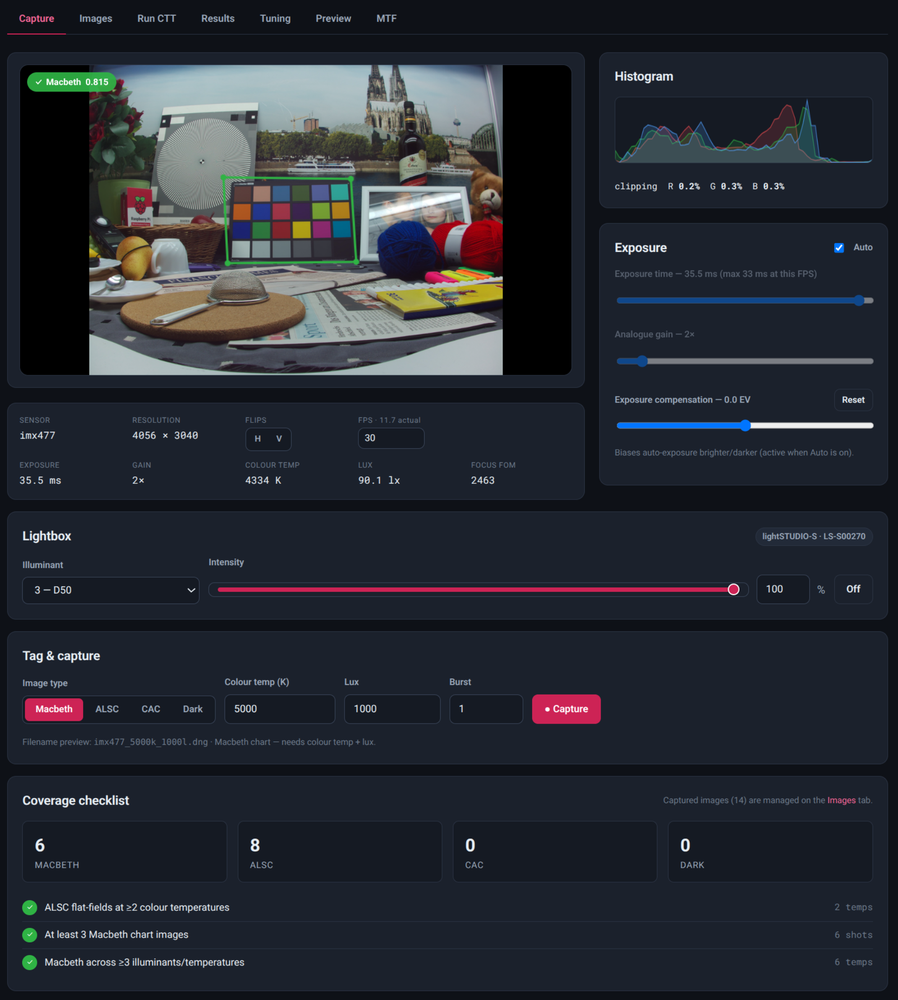
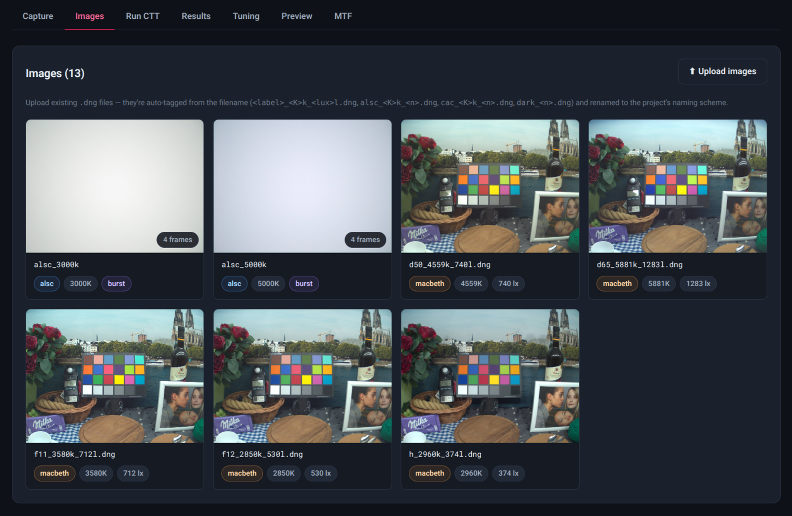
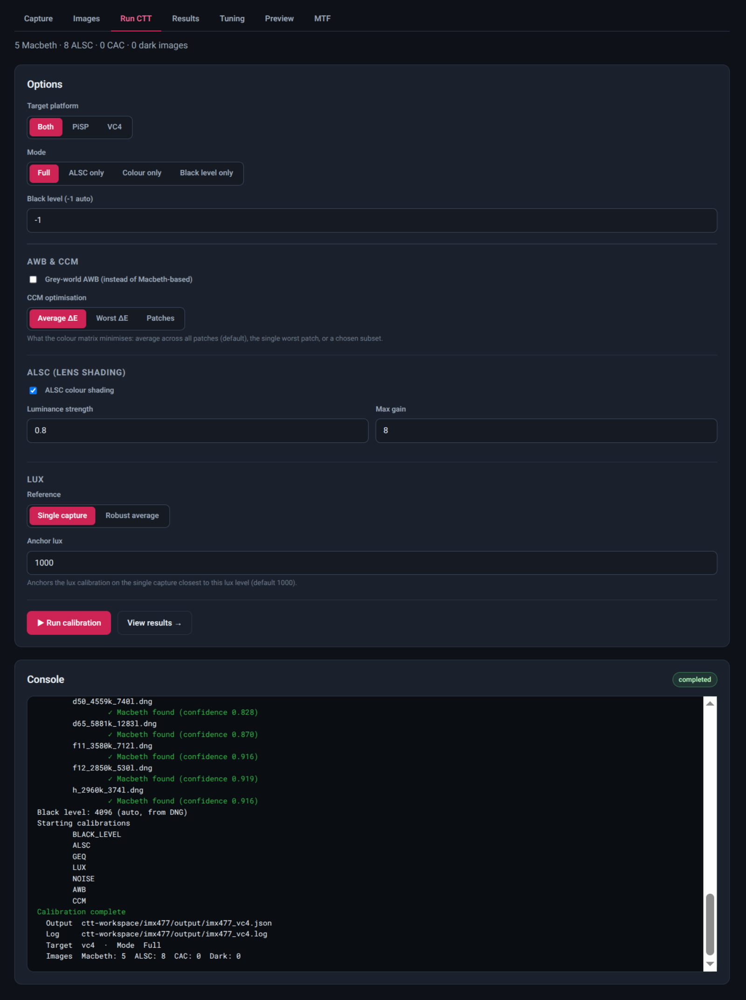
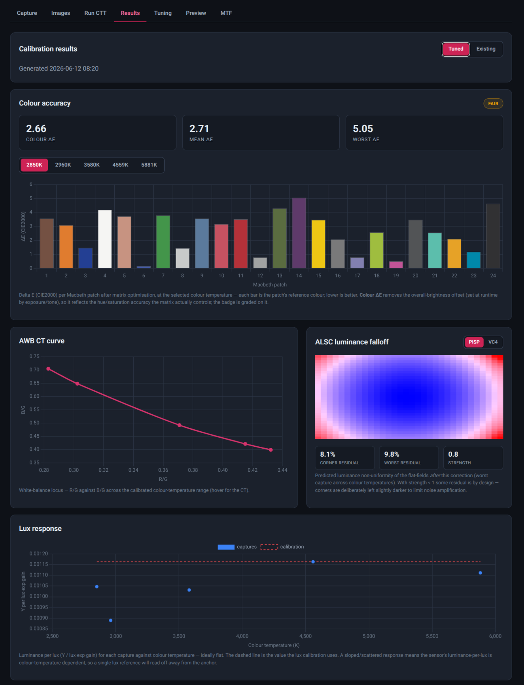
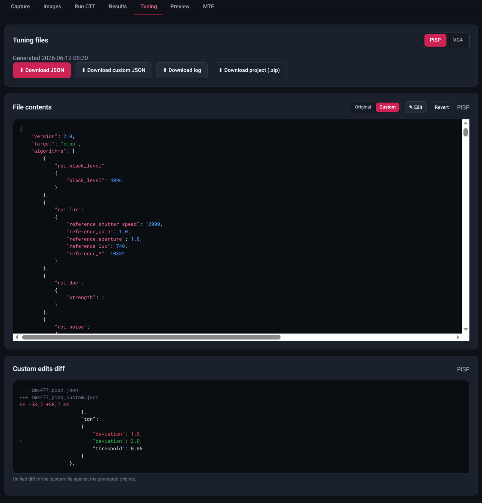
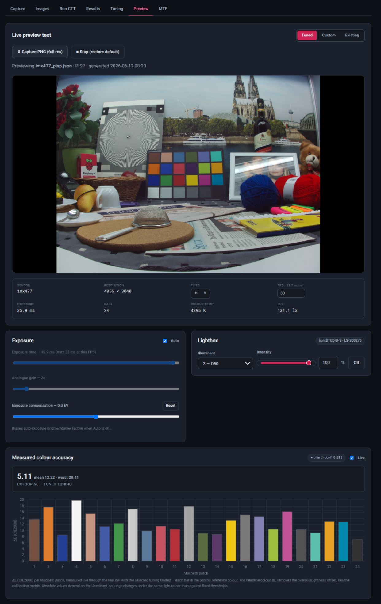
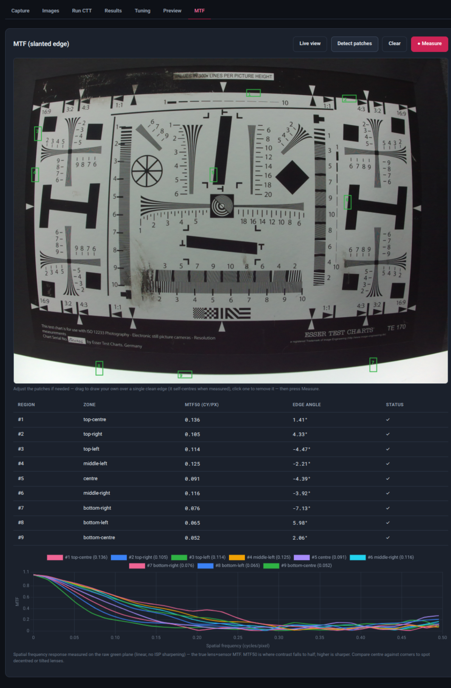

# CTT server

`ctt-server` is an optional web UI for capturing, tagging and tuning calibration
images, served from the Raspberry Pi. It runs as a single process on the Pi: the
server previews and captures DNGs in-process with Picamera2, files them with
CTT-correct filenames, runs the tuner in-process, and serves downloadable tuning
files with result visualisations. The client is just a web browser on any machine
on the network.

## Install and run (on the Pi)

```bash
pip install "rpi-ctt[server]"    # from PyPI
# or, from a local checkout:
pip install -e ".[server]"
ctt-server                       # HTTPS on 0.0.0.0:5000
```

`ctt-server` is **HTTPS-only**; on first run it generates a self-signed
certificate under `<workspace>/.tls` (pass `--cert`/`--key` to use your own, or
`--port` to change the port). Browse to `https://<pi-hostname>:5000` and accept
the one-time self-signed warning. Picamera2 ships with Raspberry Pi OS and is
imported lazily; if you use a virtualenv, create it with `--system-site-packages`
(or `apt install python3-picamera2`) so picamera2 is visible.

## Command-line options

| Flag | Description |
|------|-------------|
| `--host` | Bind address (default: `0.0.0.0` — the Pi is the server and the browser is usually remote) |
| `--port` | Port (default: `5000`) |
| `--workspace` | Workspace root for projects, captures and outputs (default: `~/ctt-server-workspace`) |
| `--cert` | TLS certificate (PEM); default: a self-signed certificate generated under `<workspace>/.tls` and reused on later runs |
| `--key` | TLS private key (PEM); as above |
| `--debug` | Enable Flask debug mode |

## Workflow

The tabs follow the tuning workflow in order, and each step below is one tab.
The [MTF measurement](#mtf-measurement) tab is independent of this flow and is
described separately at the end.

### 1. Create a project

Create one project per sensor (e.g. `imx477`) on the Projects page; the name
becomes the output filename base (`imx477_pisp.json`).



### 2. Capture calibration images

Frame with the live preview and histogram, set exposure/gain (or leave on
auto), and capture. Each shot is filed with a CTT-correct filename
automatically (a live filename preview is shown next to the capture button), so
you only choose the image type and enter the tags it needs. The same naming
rules apply to files uploaded on the Images tab — see
[calibration images](ctt-cli.md#calibration-images) for the conventions.

When a supported lightbox is attached (see [Device control](device-control.md)),
the capture page shows a **Lightbox** control to pick the illuminant and set
intensity; it is hidden when no device is present.

#### Macbeth (needs colour temperature + lux)

Images of a Macbeth ColorChecker chart, used for AWB, CCM, noise, lux and GEQ.

- Light the chart with one known illuminant at a time and enter its colour
  temperature and the measured lux at the chart.
- The live **Macbeth finder** overlays the detected chart on the preview and
  warns when detection confidence is low or the chart is **too small** in the
  frame — move closer or zoom until the warning clears. If the finder cannot
  see the chart, neither will CTT.
- Expose so the white patch is bright but not clipped (use the histogram), and
  avoid reflections or shadows falling across the chart.



#### ALSC (needs colour temperature)

Uniform flat-field images for lens shading correction.

- Aim the camera at an evenly lit, featureless surface — ideally an integrating
  light source or a diffuser placed over the lens.
- **Defocus the image** (or rely on the diffuser): any visible texture or
  detail ends up in the shading tables.
- Capture sets at multiple colour temperatures so the colour shading can be
  interpolated between illuminants.

#### CAC (needs colour temperature; PiSP only)

Images of a chromatic-aberration dot chart, used to calibrate chromatic
aberration correction. Frame the dot grid so it covers the whole field of view,
in sharp focus.

#### Dark frames (no tags)

Zero-light captures — lens cap on, completely dark — used to measure the sensor
black level. Capture several at different shutter and gain settings to check
the black level is stable against exposure.

#### Coverage checklist

The capture page tracks a minimum coverage checklist as you go:

- ALSC flat-fields at **2 or more** colour temperatures
- **At least 3** Macbeth chart images
- Macbeth images across **3 or more** illuminants/temperatures

These are minimums for a usable tuning; more illuminants (e.g. F12, F11, D50,
D65 from a lightbox) give better AWB and CCM interpolation across the colour
temperature range.

### 3. Review the images

Captures are reviewed, re-tagged, excluded or deleted on the **Images** tab,
which also shows per-image EXIF detail and a loupe for close inspection:



### 4. Run CTT

Pick targets (PiSP/VC4/both) and mode (full / ALSC-only / colour-only); CTT
progress streams live in the console.



### 5. Results

Download the tuning `.json`/`.log` or the whole project as a zip, and inspect
the AWB curve, per-CT CCM matrices, ALSC shading heatmap and lux/noise
references parsed from the output JSON.



### 6. Edit the tuning

The Tuning tab shows the full contents of the generated tuning file
(syntax-highlighted, with a PiSP/VC4 selector) and lets you hand-edit it:

- **Edit** opens the JSON in an editor; saving writes a **custom copy**
  (`<project>_<target>_custom.json`) alongside the generated original, which is
  never modified. An Original/Custom toggle switches the view, and a unified
  diff of the custom edits against the original is shown below.
- **Revert** discards the custom copy. Custom edits are also discarded when CTT
  regenerates that target's tuning, so re-running CTT always starts you from a
  clean original.
- Both the original and the custom file can be downloaded, and the custom
  tuning can be tested live from the Preview tab.



### 7. Preview the tuning live

The Preview tab restarts the camera with a chosen tuning file and streams a
live preview through the real ISP, so you judge the result exactly as
applications will see it. A segmented control switches between the **Tuned**
(generated), **Custom** (hand-edited, when one exists) and **Existing**
(built-in default) tunings for an A/B comparison; the tuning matching this
Pi's ISP is used. Stopping the preview (or returning to the Capture tab)
restores the default tuning.

While previewing you can:

- inspect detail with a click-and-hold loupe magnifier, and capture a
  full-resolution PNG;
- control exposure — auto with EV compensation, or manual exposure time and
  analogue gain, plus an FPS limit (0 = unconstrained, allowing long
  exposures) and H/V flips;
- drive an attached [lightbox](device-control.md) to switch illuminants
  without leaving the page;
- measure **colour accuracy** semi-live: point the camera at a Macbeth chart
  and the page reports the measured colour error (with chart-detection
  confidence) through the real ISP, updating automatically while the chart is
  detected.



## Modulation Transfer Function (MTF) measurement

The MTF tab measures lens sharpness with the slanted-edge method (ISO 12233).
It is independent of the tuning run — it needs only the camera and an
ISO 12233 / eSFR-style chart whose edges are slanted a few degrees off
vertical/horizontal.

1. **Frame and focus** — open the live view, frame the chart and focus using
   the **Focus FoM** readout (higher is sharper).
2. **Detect patches** — a raw DNG is captured and measurement regions are
   placed automatically on the slanted edges it finds. Regions can also be
   added, moved or deleted by hand on the captured image, and are snapped so
   the edge sits centred in the region.
3. **Measure** — each region is analysed on the green plane of the raw capture
   (so the result reflects the lens and sensor, not the ISP) and reported as an
   MTF curve with its **MTF50** figure, labelled by frame zone (centre,
   corners, …) to show how sharpness falls off across the field.


