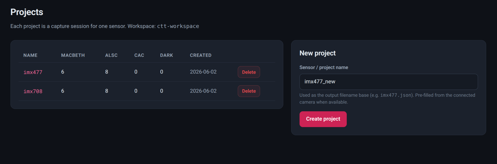
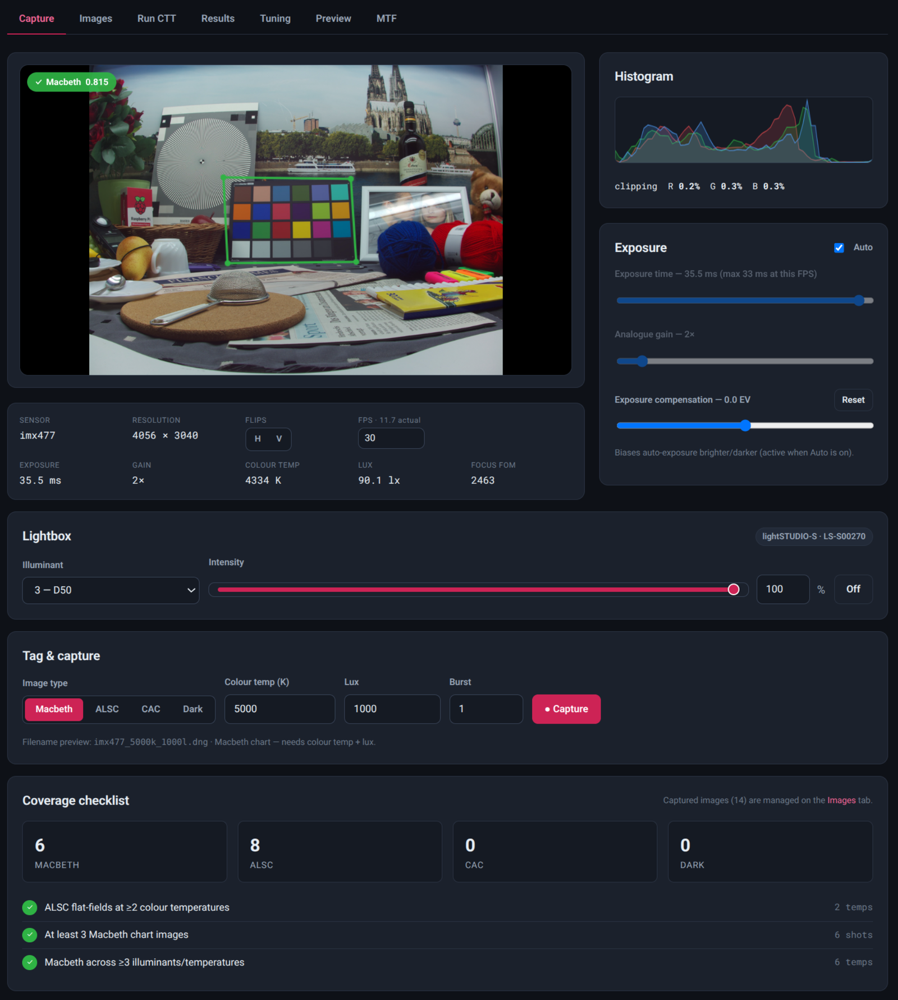
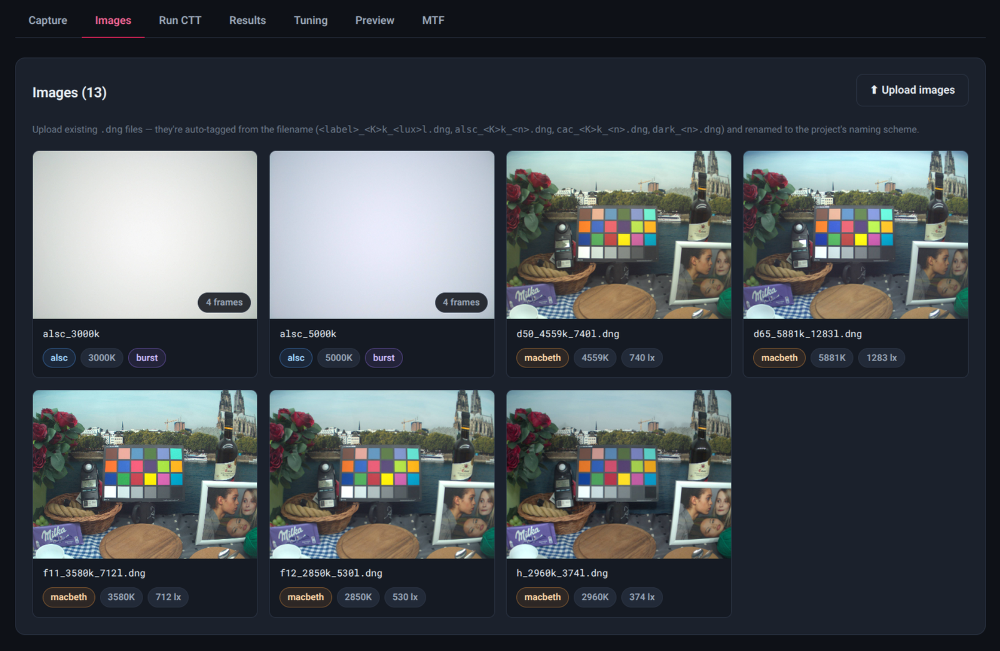
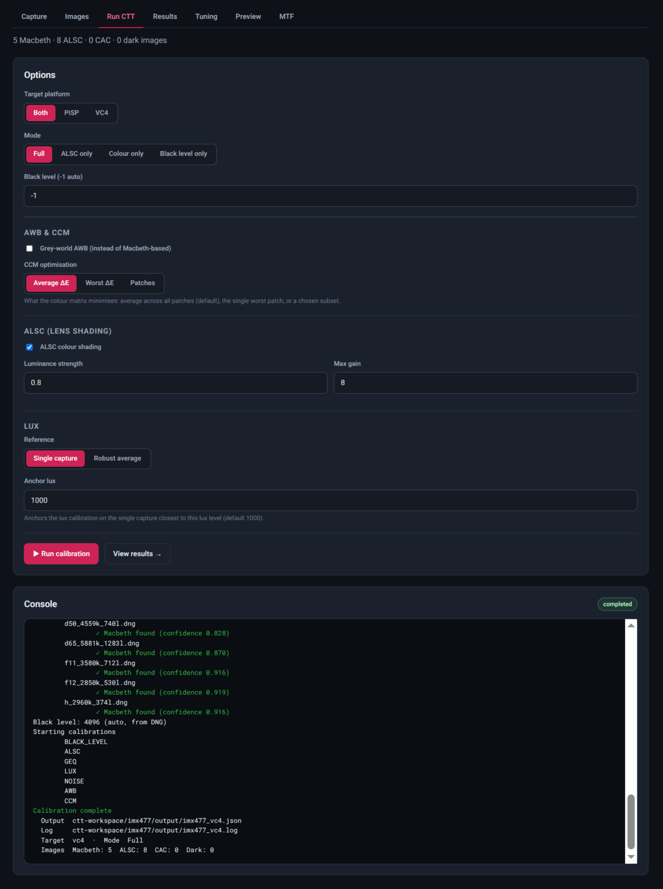
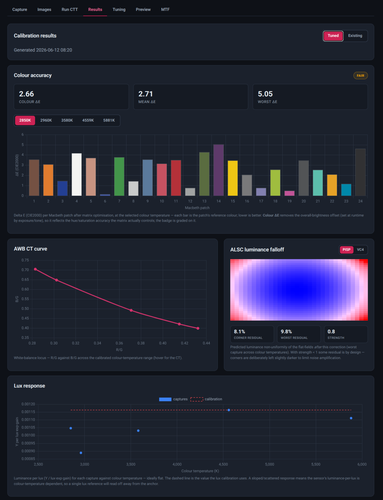
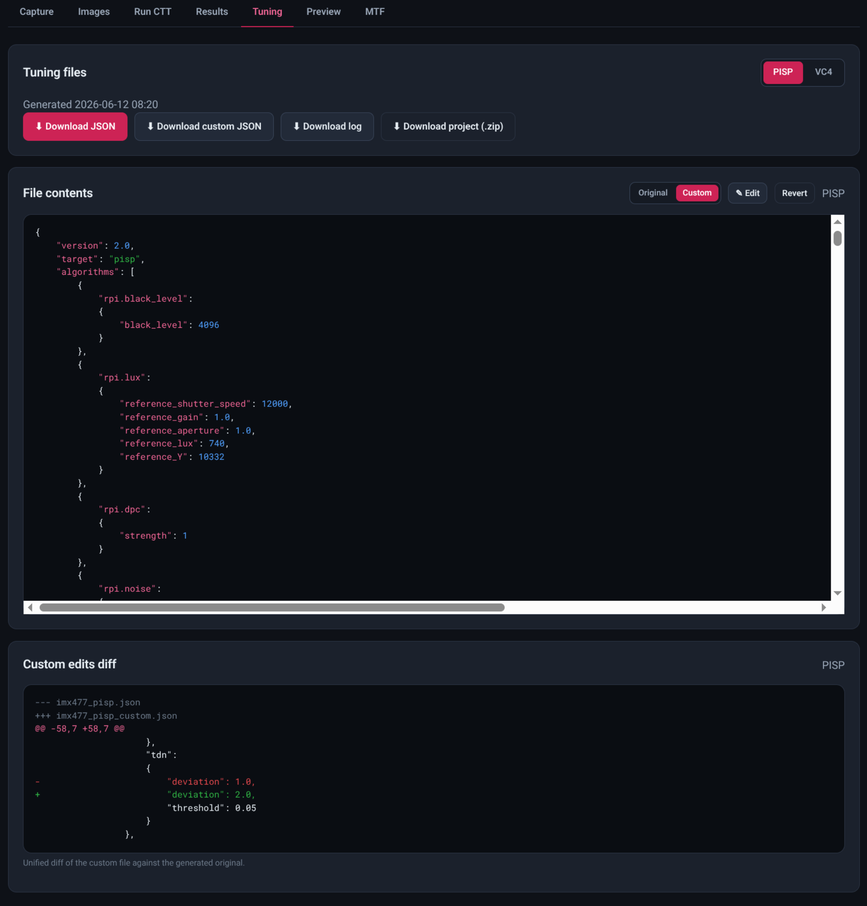
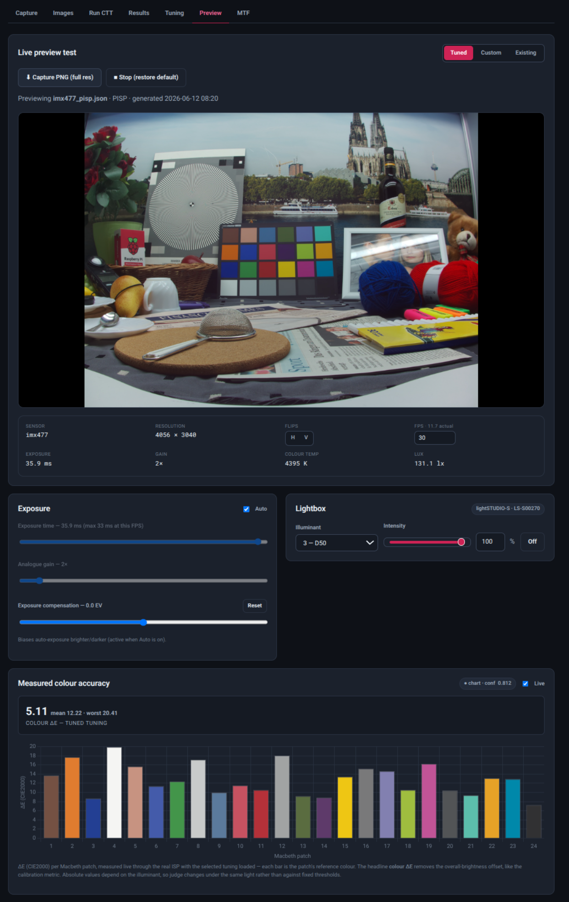
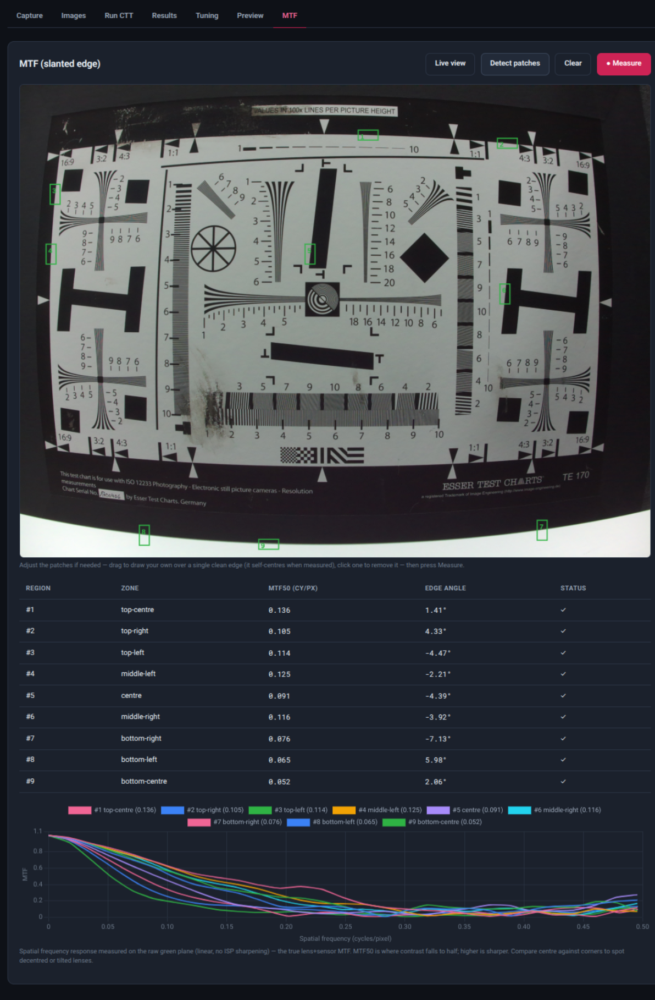
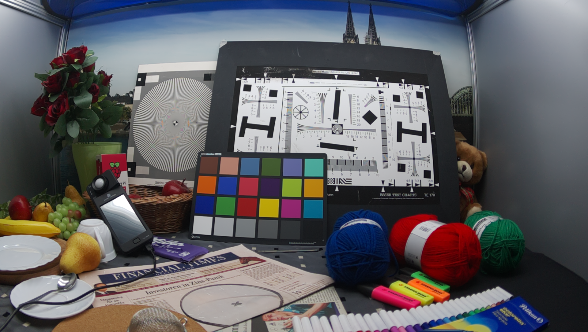

# CTT server

`ctt-server` is an optional web UI for capturing, tagging and tuning calibration
images, served from the Raspberry Pi. It runs as a single process on the Pi: the
server previews and captures DNGs in-process with Picamera2, files them with
CTT-correct filenames, runs the tuner in-process, and serves downloadable tuning
files with result visualisations. The client is just a web browser on any machine
on the network.

## Install and run (on the Pi)

```bash
pip install "rpi-ctt[server]"    # from PyPI
# or, from a local checkout:
pip install -e ".[server]"
ctt-server                       # HTTPS on 0.0.0.0:5000
```

`ctt-server` is **HTTPS-only**; on first run it generates a self-signed
certificate under `<workspace>/.tls` (pass `--cert`/`--key` to use your own, or
`--port` to change the port). Browse to `https://<pi-hostname>:5000` and accept
the one-time self-signed warning. Picamera2 ships with Raspberry Pi OS and is
imported lazily; if you use a virtualenv, create it with `--system-site-packages`
(or `apt install python3-picamera2`) so picamera2 is visible.

## Command-line options

| Flag | Description |
|------|-------------|
| `--host` | Bind address (default: `0.0.0.0` — the Pi is the server and the browser is usually remote) |
| `--port` | Port (default: `5000`) |
| `--workspace` | Workspace root for projects, captures and outputs (default: `~/ctt-server-workspace`) |
| `--cert` | TLS certificate (PEM); default: a self-signed certificate generated under `<workspace>/.tls` and reused on later runs |
| `--key` | TLS private key (PEM); as above |
| `--debug` | Enable Flask debug mode |

## Workflow

The tabs follow the tuning workflow in order, and each step below is one tab.
The [MTF measurement](#mtf-measurement) tab is independent of this flow and is
described separately at the end.

### 1. Create a project

Create one project per sensor (e.g. `imx477`) on the Projects page; the name
becomes the output filename base (`imx477_pisp.json`).



### 2. Capture calibration images

Frame with the live preview and histogram, set exposure/gain (or leave on
auto), and capture. Each shot is filed with a CTT-correct filename
automatically (a live filename preview is shown next to the capture button), so
you only choose the image type and enter the tags it needs. The same naming
rules apply to files uploaded on the Images tab — see
[calibration images](ctt-cli.md#calibration-images) for the conventions.

When a supported lightbox is attached (see [Device control](device-control.md)),
the capture page shows a **Lightbox** control to pick the illuminant and set
intensity; it is hidden when no device is present.

When a supported light meter is attached, the page shows a **Light meter** card
with the live reading (illuminance, colour temperature, Δuv, CIE x/y, CRI Ra),
refreshed automatically while the tab is visible (toggle with **Auto**, or read
once with **Sample**). Ticking **Auto-tag** fills the capture's colour-temperature
and lux tags from the latest measured reading. Every capture taken while a meter
is present also records the measured reading in the project alongside the image
(shown as a *measured* chip on the Images tab), independent of the filename tags.
The card and Auto-tag are hidden when no meter is present.

#### Auto-capture (lightbox + light meter)

With **both** a lightbox and a light meter attached, Macbeth captures gain an
**Auto-capture…** button that runs the whole cycle unattended: pick the lamps to
calibrate (each with its own intensity), and for every lamp the server switches the
lightbox, waits for the meter to stabilise, optionally nudges the intensity so the
Macbeth chart is framed and not over-exposed, then captures a Macbeth burst tagged
from the measured reading. With **dark frames** enabled it finishes by turning the
lightbox off and pausing for you to fit the lens cap. A progress popup shows each
lamp's status and live readings, with **Cancel**; per-lamp failures are reported and
skipped, and the button is hidden unless the camera and both devices are present.

#### Macbeth (needs colour temperature + lux)

Images of a Macbeth ColorChecker chart, used for AWB, CCM, noise, lux and GEQ.

- Light the chart with one known illuminant at a time and enter its colour
  temperature and the measured lux at the chart.
- The live **Macbeth finder** overlays the detected chart on the preview and
  warns when detection confidence is low or the chart is **too small** in the
  frame — move closer or zoom until the warning clears. If the finder cannot
  see the chart, neither will CTT.
- Expose so the white patch is bright but not clipped (use the histogram), and
  avoid reflections or shadows falling across the chart.



#### ALSC (needs colour temperature)

Uniform flat-field images for lens shading correction.

- Aim the camera at an evenly lit, featureless surface — ideally an integrating
  light source or a diffuser placed over the lens.
- **Defocus the image** (or rely on the diffuser): any visible texture or
  detail ends up in the shading tables.
- Capture sets at multiple colour temperatures so the colour shading can be
  interpolated between illuminants.

#### CAC (needs colour temperature; PiSP only)

Images of a chromatic-aberration dot chart, used to calibrate chromatic
aberration correction. Frame the dot grid so it covers the whole field of view,
in sharp focus.

#### Dark frames (no tags)

Zero-light captures — lens cap on, completely dark — used to measure the sensor
black level. Capture several at different shutter and gain settings to check
the black level is stable against exposure.

#### Coverage checklist

The capture page tracks a minimum coverage checklist as you go:

- ALSC flat-fields at **2 or more** colour temperatures
- **At least 3** Macbeth chart images
- Macbeth images across **3 or more** illuminants/temperatures

These are minimums for a usable tuning; more illuminants (e.g. F12, F11, D50,
D65 from a lightbox) give better AWB and CCM interpolation across the colour
temperature range.

### 3. Review the images

Captures are reviewed, re-tagged, excluded or deleted on the **Images** tab,
which also shows per-image EXIF detail and a loupe for close inspection:



### 4. Run CTT

Pick targets (PiSP/VC4/both) and mode (full / ALSC-only / colour-only); CTT
progress streams live in the console.



### 5. Results

Download the tuning `.json`/`.log` or the whole project as a zip, and inspect
the AWB curve, per-CT CCM matrices, ALSC shading heatmap and lux/noise
references parsed from the output JSON.



### 6. Edit the tuning

The Tuning tab shows the full contents of the generated tuning file
(syntax-highlighted, with a PiSP/VC4 selector) and lets you hand-edit it:

- **Edit** opens the JSON in an editor; saving writes a **custom copy**
  (`<project>_<target>_custom.json`) alongside the generated original, which is
  never modified. An Original/Custom toggle switches the view, and a unified
  diff of the custom edits against the original is shown below.
- **Revert** discards the custom copy. Custom edits are also discarded when CTT
  regenerates that target's tuning, so re-running CTT always starts you from a
  clean original.
- Both the original and the custom file can be downloaded, and the custom
  tuning can be tested live from the Preview tab.



### 7. Preview the tuning live

The Preview tab restarts the camera with a chosen tuning file and streams a
live preview through the real ISP, so you judge the result exactly as
applications will see it. A segmented control switches between the **Tuned**
(generated), **Custom** (hand-edited, when one exists) and **Existing**
(built-in default) tunings for an A/B comparison; the tuning matching this
Pi's ISP is used. Stopping the preview (or returning to the Capture tab)
restores the default tuning.

While previewing you can:

- inspect detail with a click-and-hold loupe magnifier, and capture a
  full-resolution PNG;
- control exposure — auto with EV compensation, or manual exposure time and
  analogue gain, plus an FPS limit (0 = unconstrained, allowing long
  exposures) and H/V flips;
- drive an attached [lightbox](device-control.md) to switch illuminants
  without leaving the page;
- measure **colour accuracy** semi-live: point the camera at a Macbeth chart
  and the page reports the measured colour error (with chart-detection
  confidence) through the real ISP, updating automatically while the chart is
  detected.



## Modulation Transfer Function (MTF) measurement

The MTF tab measures lens sharpness with the slanted-edge method (ISO 12233).
It is independent of the tuning run — it needs only the camera and an
ISO 12233 / eSFR-style chart whose edges are slanted a few degrees off
vertical/horizontal.

1. **Frame and focus** — open the live view, frame the chart and focus using
   the **Focus FoM** readout (higher is sharper).
2. **Detect patches** — a raw DNG is captured and measurement regions are
   placed automatically on the slanted edges it finds. Regions can also be
   added, moved or deleted by hand on the captured image, and are snapped so
   the edge sits centred in the region.
3. **Measure** — each region is analysed on the green plane of the raw capture
   (so the result reflects the lens and sensor, not the ISP) and reported as an
   MTF curve with its **MTF50** figure, labelled by frame zone (centre,
   corners, …) to show how sharpness falls off across the field.



## Sharpen tuning (threshold, strength and limit)

The Sharpen tab tunes the three `rpi.sharpen` scalars empirically. The
**threshold** is the sharpening block's noise gate: local luminance steps
below it are treated as noise and left alone, steps above it get sharpened.
The **strength** scales the gain applied to whatever passes the gate — how
strongly edges are boosted. The **limit** caps the delta any pixel may
receive — the halo height on strong edges. Nothing in the pipeline adapts
these values to analogue gain, so they have to be chosen against real
captures.

### Threshold (noise gate)

Too low and flat areas visibly crunch with amplified sensor noise; too high
and fine real detail loses its sharpening.

1. **Frame the chart** — point the camera at a Macbeth chart, static and
   steadily lit (a lightbox works well), on the Capture tab.
2. **Pick the gain** — the sweep measures at one fixed analogue gain
   (default 8×), high enough that sensor noise is clearly visible. The stored
   threshold is a compromise across gains: tuned at this gain, images are
   slightly softer below it and slightly noisier above it.
3. **Run the sweep** — the camera is reloaded with a temporary tuning per
   point: first with sharpening disabled (the baseline), then with each
   candidate threshold. At every point the grey (bottom-row) patches are
   sampled from full-resolution processed captures and their spatial noise is
   compared against the baseline. The preview blinks on each reload; a run
   takes a few minutes. The camera's tuning and controls are restored
   afterwards.
4. **Read the curve** — the chart plots per-patch and median noise
   amplification (1.0 = no amplification) against threshold on a log axis.
   The recommended value is the smallest threshold whose median stays within
   the tolerance (default 1.15 — loose enough to absorb the metric's own
   run-to-run scatter, and at high gain the extra noise is masked by the
   noise already present, whereas an over-gated threshold loses detail at
   every gain) — the most real-detail sharpening without visible noise.
5. **Apply** — writes the recommended threshold into the project's generated
   tuning file for the live ISP platform (once a CTT run exists). Results
   persist in `<project>/sharpen/results.json`, which calibration runs never
   scan — the same isolation as `<project>/mtf/`.

### Strength and limit (edge sharpening and halos)

Tune and apply the threshold first, then run the strength sweep from the
second card. It measures at **low gain** (default 1×) — the mirror image of
the threshold sweep's high gain: with little noise, denoise barely
intervenes and sharpening acts at full force, so halos measured here are the
worst case (values chosen at high gain look tame in the measurement and
visibly oversharpen at low gain). It measures a slanted edge in the
**processed** output — an
ISO 12233 / eSFR chart (the same target as the MTF tab) is ideal, since its
standard edges are **moderate contrast** (driving the strength choice) and
its registration marks give the strong black/white edges the limit choice
needs; a printed slanted-edge card works too. Keep the Macbeth chart in the
scene if you can. The sweep captures a sharpening-off
baseline, locks the edges it finds (classified by contrast), then per
candidate strength measures on the moderate edge:

- **acutance gain** — perceived sharpness gained over the baseline: the
  contrast-sensitivity-weighted area under the MTF curve, which follows the
  mid/high-frequency band sharpening actually boosts (MTF50, often pinned by
  the optics, barely moves and is reported for reference only);
- **MTF peak** — the maximum of the frequency response (above 1.0 means
  over-unity, i.e. visibly "crisped");
- **overshoot / undershoot** — the edge halos as a fraction of the edge
  step, measured as *growth over the baseline's own profile* (a printed edge
  can carry static structure that reads as a constant halo; only what
  sharpening adds counts). The hardware deliberately applies more negative
  than positive gain, so undershoot usually leads.

The recommended strength is the one with the **greatest acutance gain**
whose worse halo stays within the halo cap (default 5% — a clean, subtle crispening; ~10% reads as punchy) *and* whose MTF
peak stays under the peak cap (default 1.5 — default-strength sharpening
measures ~1.4 and reads as crisp, not crunchy) — maximum perceived sharpness
without visible halos. (The gain need not rise with strength: the threshold
gates responses and the limit clips them, so the curve can flatten or fall;
on a monotonic curve this degenerates to the largest acceptable strength.)
At that strength the sweep then
steps the limit, measuring halos on the high-contrast edge (the only place
the delta cap engages), and recommends the largest limit within the halo cap.
When the Macbeth chart shares the scene, grey-patch noise is also recorded
per point, confirming the threshold choice still holds at the final strength.

Processed output is tone-curve-encoded, so absolute MTF figures are biased —
every number shown is a ratio against the identically-encoded baseline, which
is why the scene must stay static and steadily lit for the whole run.



## HTTP API

The web UI is driven by a JSON-over-HTTPS API on the same port, which can also
be scripted directly (e.g. to automate captures). It is unauthenticated and
unversioned — treat it as internal and subject to change. Errors are returned
as JSON `{"error": "..."}` with a 4xx status, or 503 when the camera, lightbox
or light meter is not available.

### Camera (shared live camera)

| Method | Path | Description |
|--------|------|-------------|
| GET | `/api/health` | Camera presence, model and resolution |
| GET | `/api/preview` | Live MJPEG preview stream |
| GET | `/api/controls` | Current exposure controls and their limits |
| POST | `/api/controls` | Set controls (auto exposure, exposure time, gain, EV, FPS) |
| POST | `/api/transform` | Set `{"hflip": bool, "vflip": bool}` |
| GET | `/api/histogram` | RGB histogram of the current preview |
| GET | `/api/macbeth` | Live Macbeth chart detection (the capture-page finder) |
| GET | `/api/macbeth-deltae` | Per-patch delta E against reference colours, measured through the currently loaded tuning |

### Lightbox

| Method | Path | Description |
|--------|------|-------------|
| GET | `/api/lightbox` | Status: presence, model, illuminants, illuminant labels/temps/defaults, current channel/intensity |
| POST | `/api/lightbox` | One of `{"off": true}`, `{"illuminant": "D65", "percent": 50}`, `{"channel": 4, "percent": 50}` or `{"percent": 50}` (current channel) |

### Light meter

| Method | Path | Description |
|--------|------|-------------|
| GET | `/api/lightmeter` | Read-only status: `{"present": bool, ...model/serial, "limits": {...}}` (takes no measurement). `limits` gives the meter's valid range (`illuminance_min`/`max`, `colour_min_lux`, `cct_min`/`max`) or `null` |
| POST | `/api/lightmeter` | `{"action": "sample"}` — take one measurement; returns identity, `limits`, and `reading` (the full `Measurement.to_dict()`, including `in_range`). The reading is capped to the limits: `in_range` is `false` out of range, illuminance is clamped to the nearest bound (never the device sentinel like `-100 lx`), and colour metrics are omitted when there is less than `colour_min_lux` of light |

A reading taken while out of range is never recorded with a capture (the capture stores
no `lightmeter` metadata), and the automated flows reject it (see Auto-capture /
Auto-characterise): stabilisation fails the step with an "add light" message rather than
tagging or sweeping against a bad reading. The web UI shows out-of-range values in red.

### Auto-capture (needs a lightbox and a light meter)

| Method | Path | Description |
|--------|------|-------------|
| GET | `/projects/<name>/auto-capture/stream` | Run the cycle, streaming progress as Server-Sent Events. Query: `lamps=D65:100,F12:80` (name:percent, percent optional), `frames=1-16`, `darks=1`, `adjust=1`. Each `data:` line is a JSON event; the terminal event is `done` (or `error`) |
| POST | `/projects/<name>/auto-capture/continue` | Release a cycle paused at the lens-cap prompt (409 if none is waiting) |
| POST | `/projects/<name>/auto-capture/cancel` | Stop the running cycle (409 if none is running) |

### Projects and captures

| Method | Path | Description |
|--------|------|-------------|
| POST | `/projects` | Create a project (form field `name`) |
| POST | `/projects/<name>/delete` | Delete a project and all its files |
| POST | `/projects/<name>/capture` | Capture a still: `{"image_type": "macbeth"\|"alsc"\|"cac"\|"dark", "colour_temp": K, "lux": n, "label": s, "frames": 1-16}`; bursts save as indexed files. A light-meter reading (if present) is recorded with each capture |
| POST | `/projects/<name>/upload` | Import files (multipart `files`), auto-tagged from their CTT-format names; returns `added` and `skipped` |
| POST | `/projects/<name>/captures/<file>/delete` | Delete a capture |
| POST | `/projects/<name>/captures/<file>/exclude` | `{"excluded": bool}` — exclude from runs without deleting |
| GET | `/projects/<name>/captures/<file>/jpeg` | Preview JPEG; `?source=jpeg\|raw\|auto`, `?thumb=1` for a fast half-size develop |
| GET | `/projects/<name>/captures/<file>/exif` | EXIF summary of a capture |
| GET | `/projects/<name>/blacklevel` | Black level measured from the project's dark frames |

### Run, results and downloads

| Method | Path | Description |
|--------|------|-------------|
| GET | `/projects/<name>/run/stream` | Run CTT, streaming output as server-sent events. Query params: `targets` (`pisp,vc4`), `mode` (`full`/`alsc-only`/`colour-only`), plus config overrides (`greyworld`, `do_alsc_colour`, `luminance_strength`, `max_gain`, `blacklevel`, `disable`, `matrix_selection`, `test_patches`, `flare_compensation`, `lux_reference_target`, `lux_reference_method`) |
| GET | `/projects/<name>/results/data?target=` | Parsed tuning data for the Results visualisations |
| GET | `/projects/<name>/archive` | The whole project (DNGs + outputs) as a zip |
| GET | `/projects/<name>/download/<kind>/<target>` | Download an output; `kind` is `json`, `log` or `custom` |

### Tuning edits and live preview

| Method | Path | Description |
|--------|------|-------------|
| GET | `/projects/<name>/tuning-data/<target>` | `{original, custom, diff}` tuning file texts |
| POST | `/projects/<name>/tuning/custom/<target>` | Save hand edits: `{"json": "<text>"}` (validated as JSON) |
| POST | `/projects/<name>/tuning/custom/<target>/delete` | Revert: remove the custom file |
| POST | `/projects/<name>/preview-test` | Restart the camera with this project's tuning; `{"kind": "generated"\|"custom"}` (custom files are canary-tested in a subprocess first) |
| POST | `/api/preview-default` | Restore the built-in default tuning |
| GET | `/projects/<name>/preview-capture` | Full-resolution PNG still from the live preview |

### MTF

| Method | Path | Description |
|--------|------|-------------|
| POST | `/projects/<name>/mtf/capture` | Capture a fresh chart frame (raw DNG + preview JPEG) |
| GET | `/projects/<name>/mtf/preview` | The captured chart's preview JPEG |
| POST | `/projects/<name>/mtf/auto` | Auto-detect slanted-edge regions; returns `{"rois": [...]}` |
| POST | `/projects/<name>/mtf/measure` | Measure `{"rois": [{x, y, w, h}, ...]}`; returns MTF curves and MTF50 per region |

### Sharpen

| Method | Path | Description |
|--------|------|-------------|
| GET | `/projects/<name>/sharpen/data` | Stored sweep results (`{threshold, strength}` sections) plus context: `{results, target, base, can_apply, running}` |
| GET | `/projects/<name>/sharpen/sweep/stream` | Run a threshold sweep, streaming progress as Server-Sent Events. Query: `gain` (default 8), `frames` (1-8), `thresholds` (comma list), `tolerance`. Events: `start`, `log`, `chart`, `baseline`, `point`, then `done` (or `error`) |
| GET | `/projects/<name>/sharpen/strength/stream` | Run a strength + limit sweep. Query: `gain`, `frames`, `strengths` (comma list), `limits` (comma list), `overshoot_cap` (fraction), `peak_cap`. Events: `start`, `log`, `edges`, `baseline`, `point` (with `phase`: `strength`/`limit`), then `done` (or `error`) |
| POST | `/projects/<name>/sharpen/apply` | Write any of `{"threshold": t, "strength": s, "limit": l}` (at least one) into the project's generated tuning's `rpi.sharpen` block (400 before a CTT run exists) |
